## Assignment 3 - Responsive Web Design
Name: Saida Amirgaliyeva  
Group: IT-2513

# Project Description
I created a responsive music website (SoundSpace) using HTML, CSS, CSS Media Queries, and Bootstrap 5.
The website adapts to mobile, tablet, and desktop screen sizes.

Task 0 - Responsive Typography:
I created a hero section with responsive text.
The font size changes for different screen sizes using CSS Media Queries.

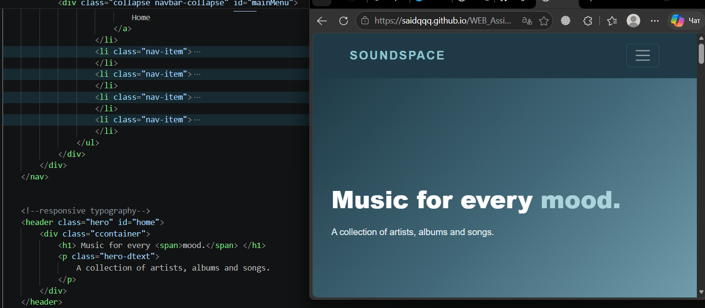

---

Task 1 - Responsive Layout with Media Queries:
I created three artist cards using CSS Flexbox and Media Queries.
Mobile: 1 card per row
Tablet: 2 cards per row
Desktop: 3 cards per row

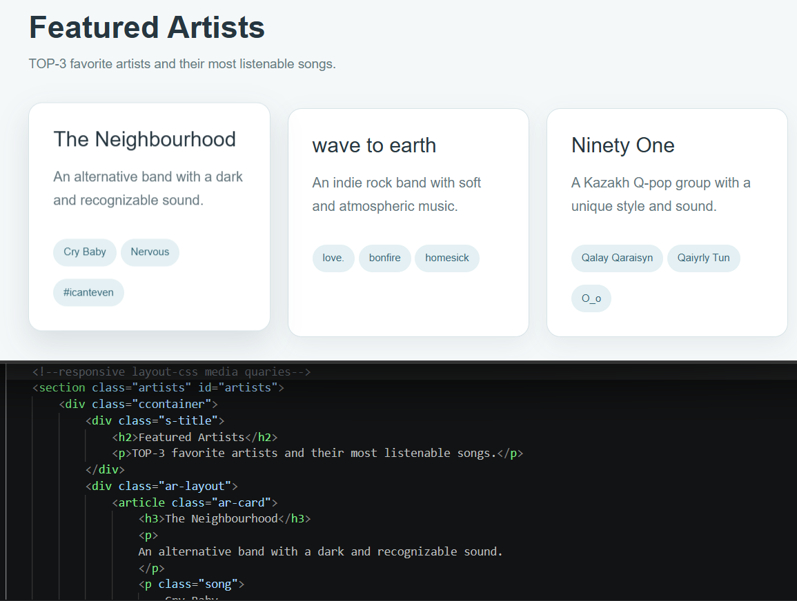

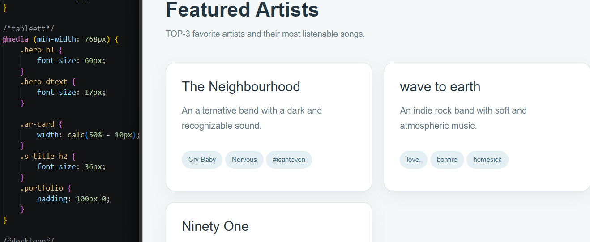

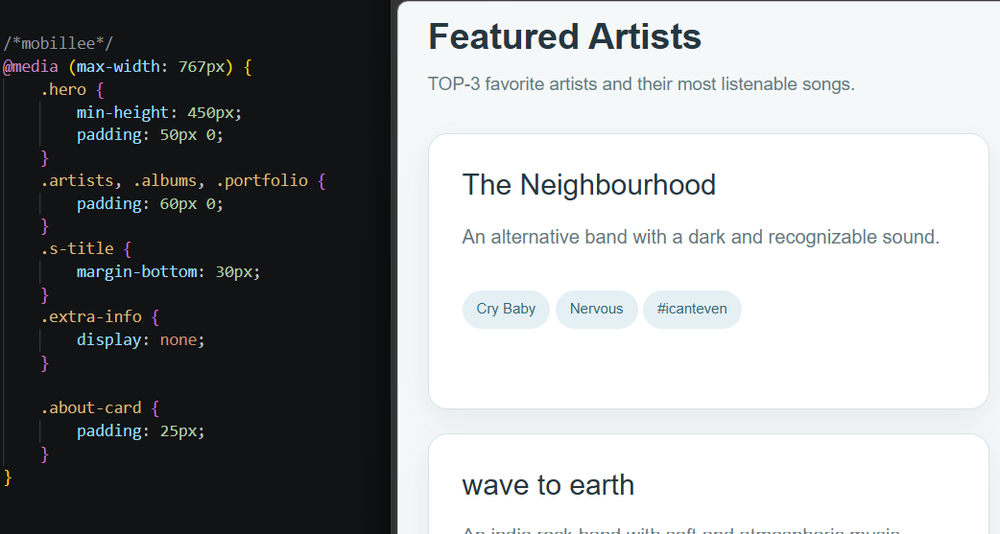

---

Task 2 - Bootstrap Grid:
I created three responsive music cards using the Bootstrap 12-column Grid System.
I used: col-12 col-md-6 col-lg-4
Mobile: 1 column
Tablet: 2 columns
Desktop: 3 columns

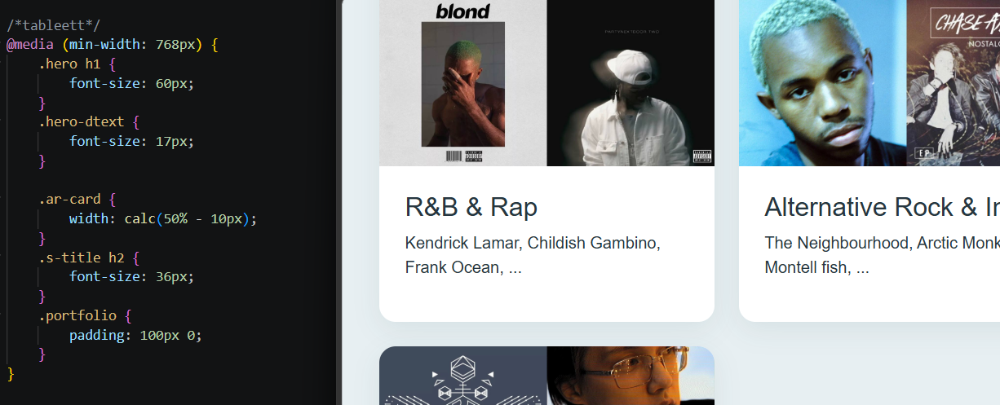

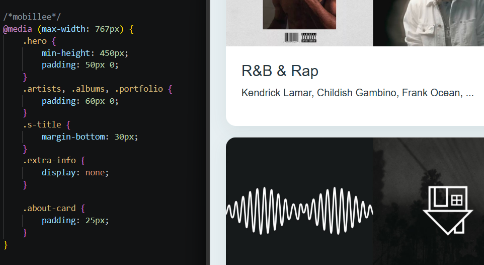

---

Task 3 - Responsive Bootstrap Navbar:
I created a responsive navigation bar using Bootstrap.
On large screens, the navigation links are displayed normally. On smaller screens, the navbar collapses into a hamburger menu.

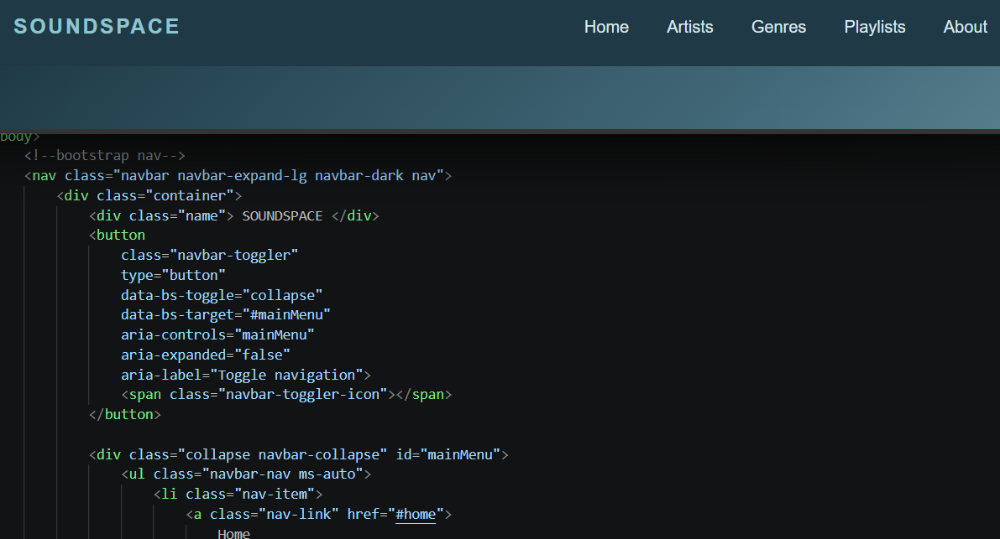

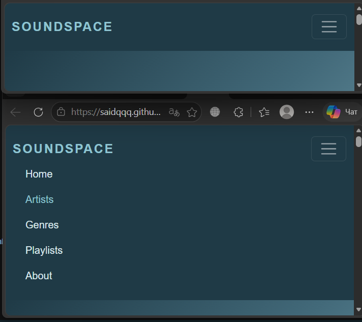

---

Task 4 - Responsive Music Portfolio:
I created a responsive music portfolio using Bootstrap Grid and CSS Media Queries.
The section contains playlist cards and an About Me sidebar.
The layout changes depending on the screen size, and some extra information is hidden on mobile.

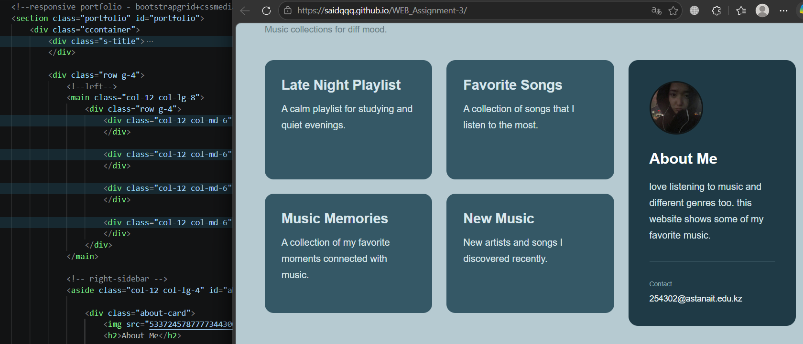

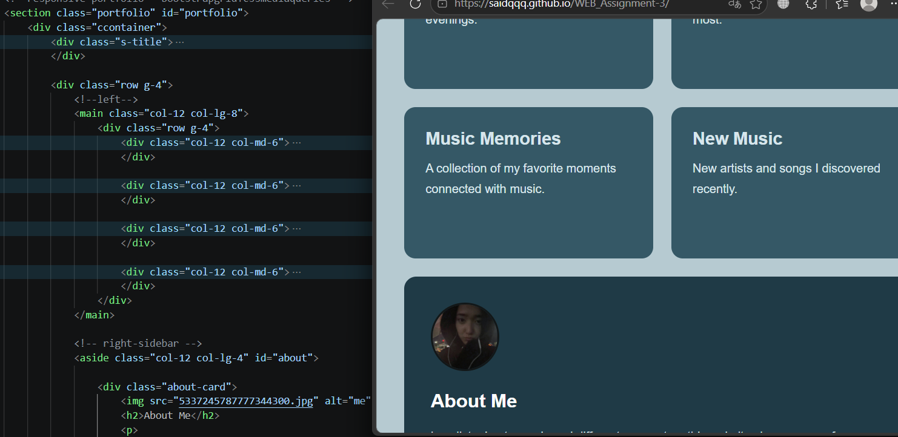

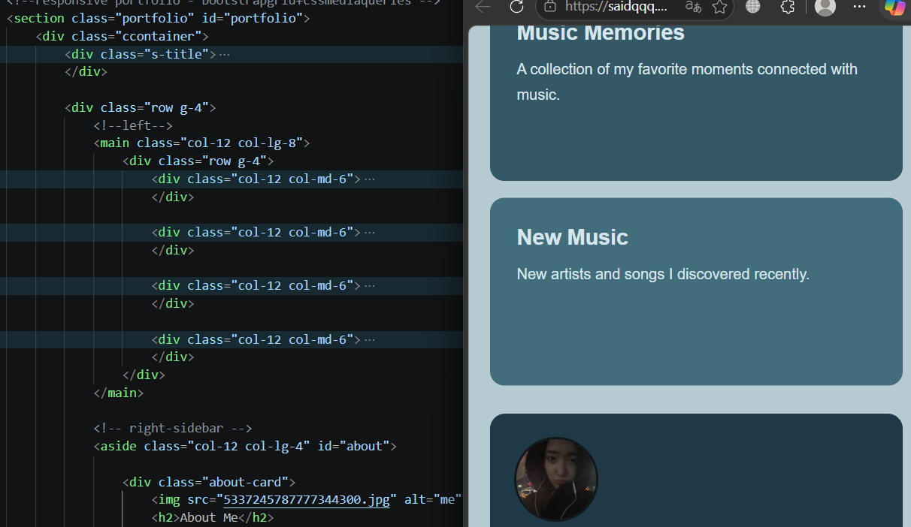

---

Work Process:
First, I created the HTML structure of the website. Then I added CSS styles and used Media Queries for responsive typography and the artist cards.
After that, I used the Bootstrap 12-column Grid System for responsive cards and the portfolio section. I also used a Bootstrap responsive navbar with a hamburger menu.
Finally, I tested the website on mobile, tablet, and desktop screen sizes.

---

Technologies:
- HTML5
- CSS3
- CSS Media Queries
- Flexbox
- Bootstrap 5
- Bootstrap Grid System